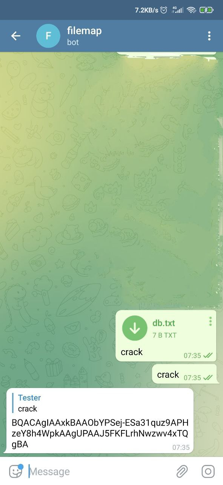

# [@Filemapbot](https://t.me/filemapbot)

This is a key-value database for telegram bots.

1. To enable bots to interact with [@filemapbot](https://t.me/filemapbot), add them to the same channel with
   administrator rights.
1. To save the file, send it with the key in the caption.
1. To read the [file ID](https://core.telegram.org/bots/api#document), send the key in the message.

## Usage



```shell
[2021-07-19 07:35:11.686] [info] chat id 381097054 saved file id BQACAgIAAxkBAAObYPSej-ESa31quz9APHzeY8h4WpkAAgUPAAJ5FKFLrhNwzwv4xTQgBA with key crack
[2021-07-19 07:35:15.987] [info] chat id 381097054 requested file with key crack
[2021-07-19 07:35:17.831] [info] chat id 381097054 found file id BQACAgIAAxkBAAObYPSej-ESa31quz9APHzeY8h4WpkAAgUPAAJ5FKFLrhNwzwv4xTQgBA by key crack
```

## Deploy

[](https://cloud.digitalocean.com/apps/new?repo=https://github.com/demidko/filemapbot/tree/main)

